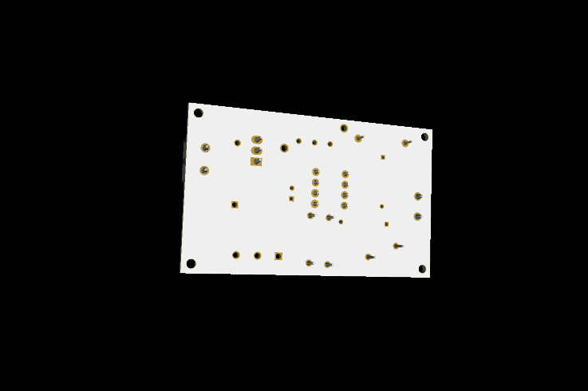
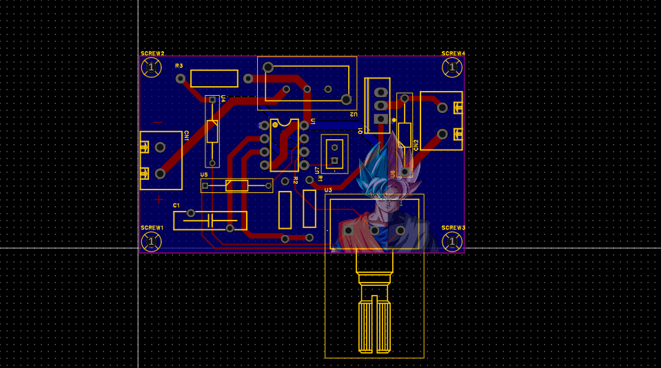
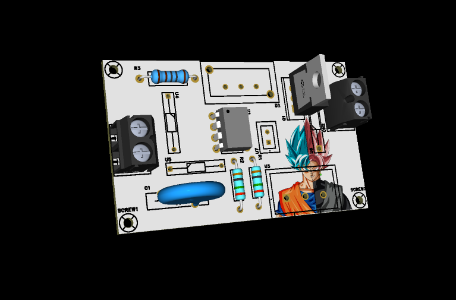
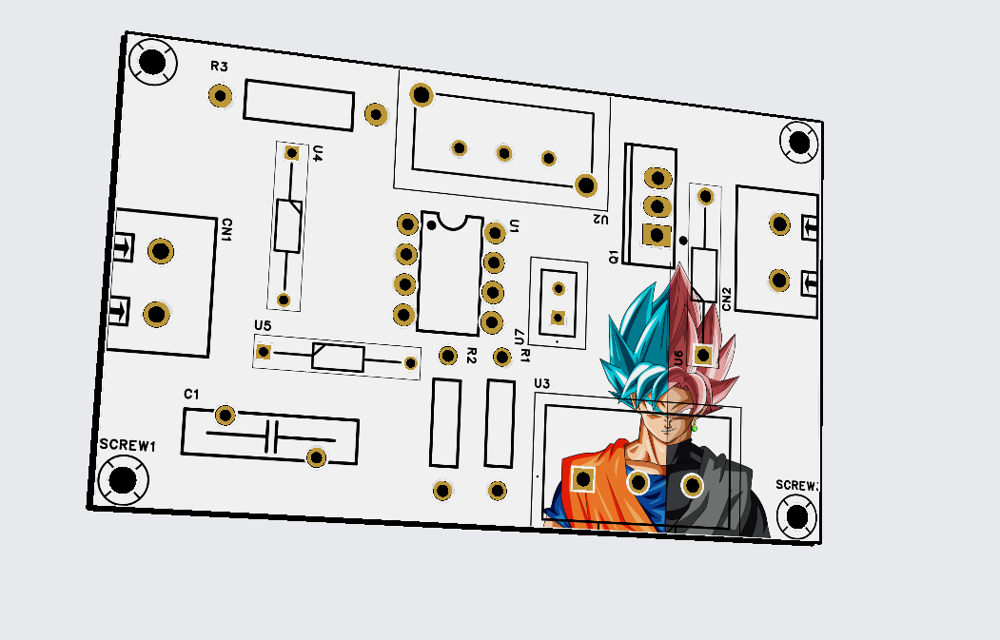
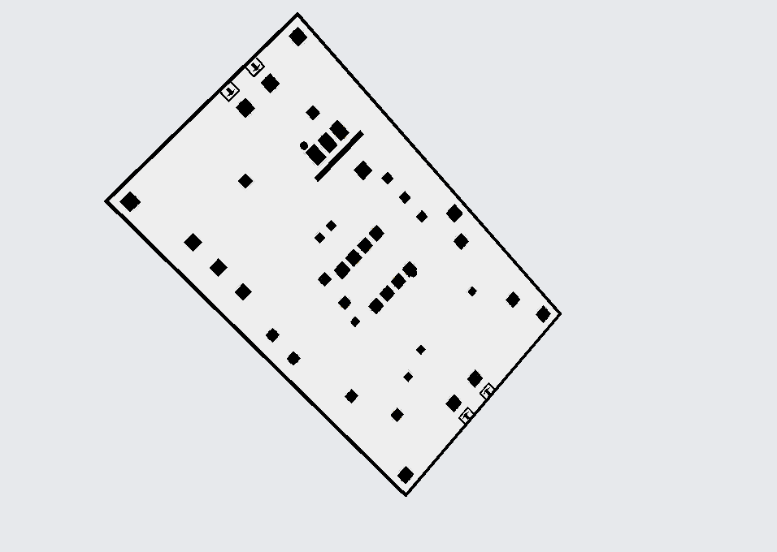
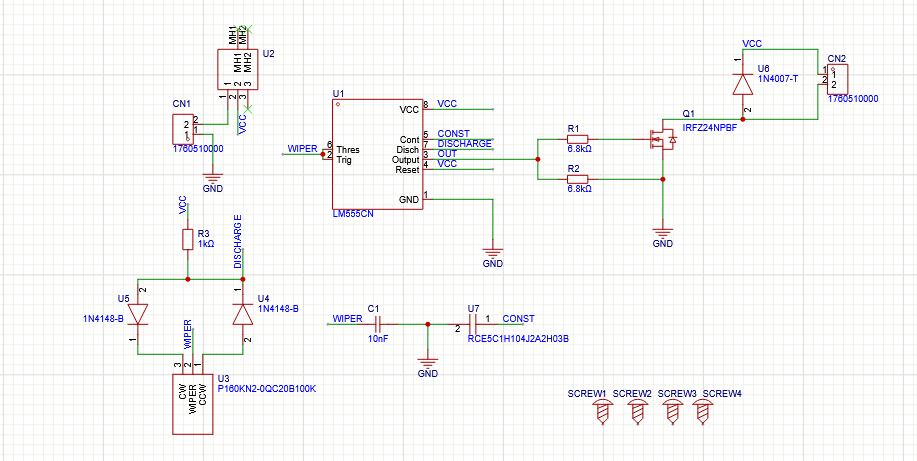

<h1 align="center">Motor Speed Control</h1>

PWM Based DC Motor Controller (555 Timer + MOSFET)

---

## Overview

  
  

  
  

---

## 3D Views

  
  

---

## Circuit

  

---

##  Features

* PWM speed control using 555 timer
* MOSFET-based motor switching
* Adjustable speed via potentiometer
* Compact PCB design

---
